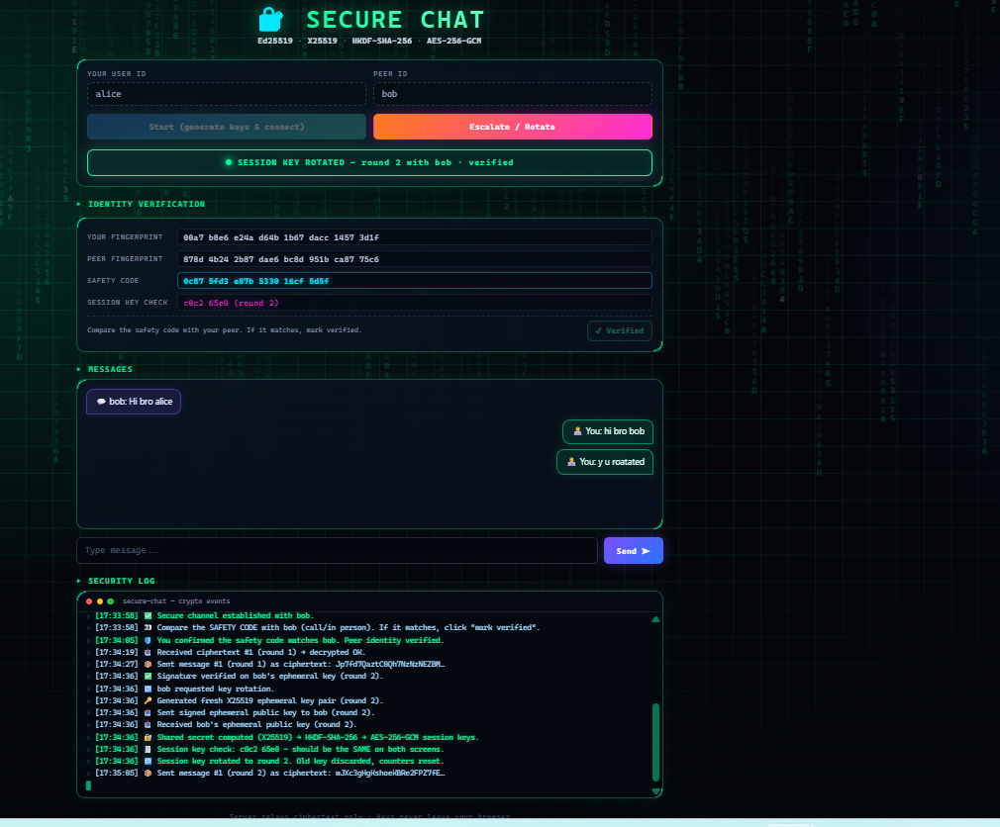
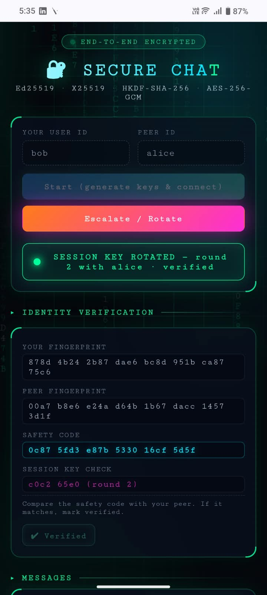
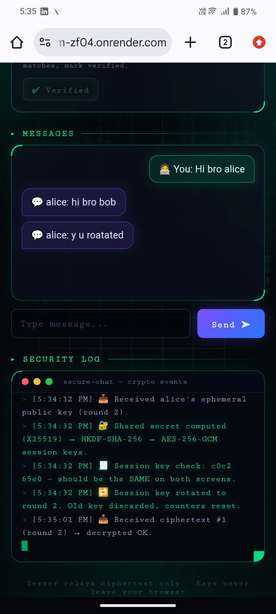
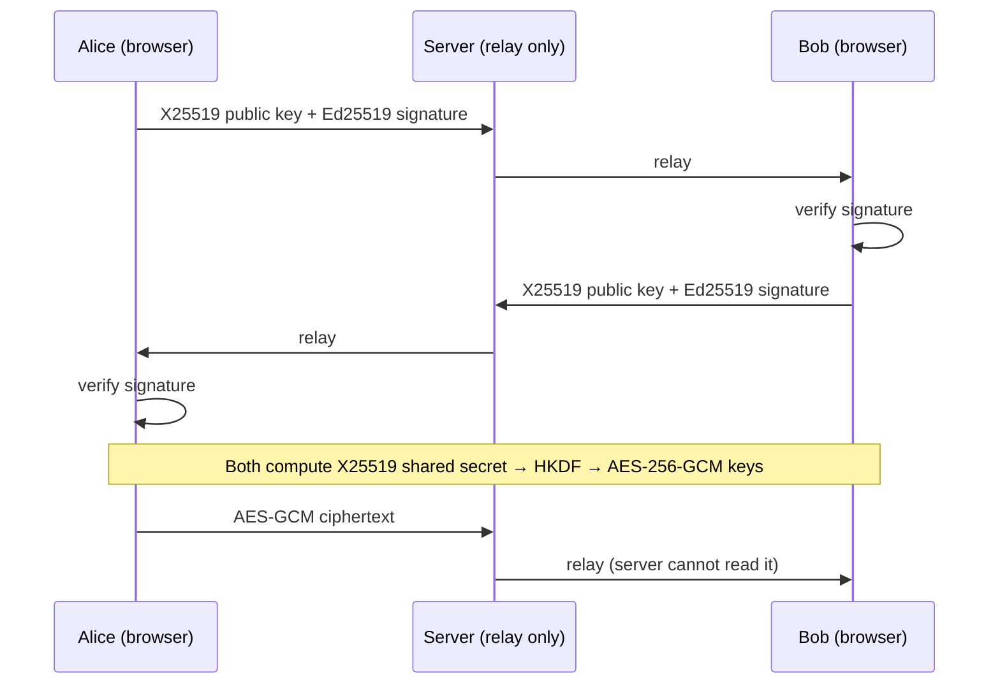

# 🔐 Secure Chatroom

**An end-to-end encrypted two-user chat built with the browser's native Web Crypto API.**
Messages are encrypted in the browser, and the server only ever relays ciphertext.


### 🌐 Live demo: **https://secure-chatroom-zf04.onrender.com**

> Hosted on Render's free plan. If nobody has used it for a while, the first load takes about 50 seconds while the server wakes up. After that it's fast.

**Try it:** open the link in two windows or on two devices.
Window 1: User ID `alice`, Peer ID `bob` → **Start**.
Window 2: User ID `bob`, Peer ID `alice` → **Start**.

---

## 📸 Screenshots

**Laptop (alice) — secure channel after key rotation**



**Phone (bob) — same safety code and session key on both devices**

<p>
  
  &nbsp;&nbsp;
  
</p>

---

## ✨ Features

- **End-to-end encryption:** messages are encrypted and decrypted only in the users' browsers.
- **Signed key exchange:** every ephemeral key is signed with the sender's Ed25519 identity key.
- **Safety-code verification:** both users compare a short code to detect a man-in-the-middle.
- **Key rotation:** the *Escalate / Rotate* button runs a fresh key exchange; old keys are discarded.
- **Replay and tamper protection:** message counters plus AES-GCM authentication reject replayed or modified messages.
- **Live security log:** every cryptographic step is shown on screen.
- **Clear connection states:** NOT CONNECTED → KEY EXCHANGE → SECURE → ROTATED, with colour-coded status.
- **One server, one command:** `npm start` serves the page and the WebSocket on the same port.
- **Cyber-style UI:** dark theme, state-based colour transitions, works on phones.

---

## 🔑 How it works

| Step | Algorithm | Purpose |
|---|---|---|
| Identity key | **Ed25519** | Signs each ephemeral key so the peer knows who sent it |
| Key exchange | **X25519** | Fresh ephemeral key pair per session and per rotation |
| Key derivation | **HKDF-SHA-256** | Turns the shared secret into two AES keys (one per direction) |
| Encryption | **AES-256-GCM** | Encrypts and authenticates each message |
| Nonce | round ‖ counter | Unique for every message, never reused |
| AAD | sender ‖ receiver ‖ round ‖ counter | Binds each message to its context |



**Key rotation:** clicking *Escalate / Rotate* makes **both** users generate new X25519 keys, sign them, and derive a new session key. The old keys are deleted and the message counters reset.

---

## 🛡️ Security properties

| Property | Status |
|---|---|
| Server never sees plaintext or session keys | ✅ Implemented |
| Ephemeral keys signed with Ed25519 (tampering detected) | ✅ Implemented |
| Identity key change detected mid-session | ✅ Implemented |
| Replayed / reordered messages rejected | ✅ Implemented |
| Unique AES-GCM nonces (per-direction keys + counter) | ✅ Implemented |
| Key rotation with fresh keys on both sides | ✅ Implemented |
| Forward secrecy per session and per rotation | ✅ Implemented |
| Server sets the sender ID (no spoofing), duplicate IDs blocked | ✅ Implemented |
| HTTPS / WSS transport encryption | ✅ Implemented (live deployment on Render) |
| Peer identity verification | ⚠️ Partial — users compare the safety code manually |
| Identity persists across page reloads | ❌ Not implemented (new identity each visit) |
| User accounts, offline messages, group chat | ❌ Out of scope |

> This is a **learning prototype**, not a replacement for Signal or WhatsApp. It does not implement the Double Ratchet, and trust in the peer's identity depends on users comparing the safety code.

---

## 🚀 Run locally

Requires **Node.js 20+** and a recent Chrome, Edge, Firefox or Safari (for Ed25519 / X25519 in Web Crypto).

```bash
npm install
npm start
```

Open **http://localhost:8080** in two browser windows.

`npm run dev` restarts the server automatically when `server.js` changes.

---

## 📁 Project structure

```
secure-chatroom/
├── server.js          # serves the page + WebSocket relay (one port)
├── package.json
├── docs/              # README screenshots
└── public/
    ├── index.html     # UI (cyber theme)
    ├── app.js         # all cryptography + chat logic
    └── fx.js          # background animation + state colours (visual only)
```

---

## 🧰 Tech stack

**Frontend:** HTML, CSS, JavaScript, Web Crypto API
**Backend:** Node.js, `ws` (WebSocket)
**Hosting:** Render (HTTPS / WSS)

---

## 🔮 Future enhancements

- Save identity keys in the browser so the safety code stays the same across visits
- QR-code safety-code verification
- Double Ratchet for per-message forward secrecy
- User accounts and offline message delivery

---

**Author:** [vamsi-the-svk](https://github.com/vamsi-the-svk)
